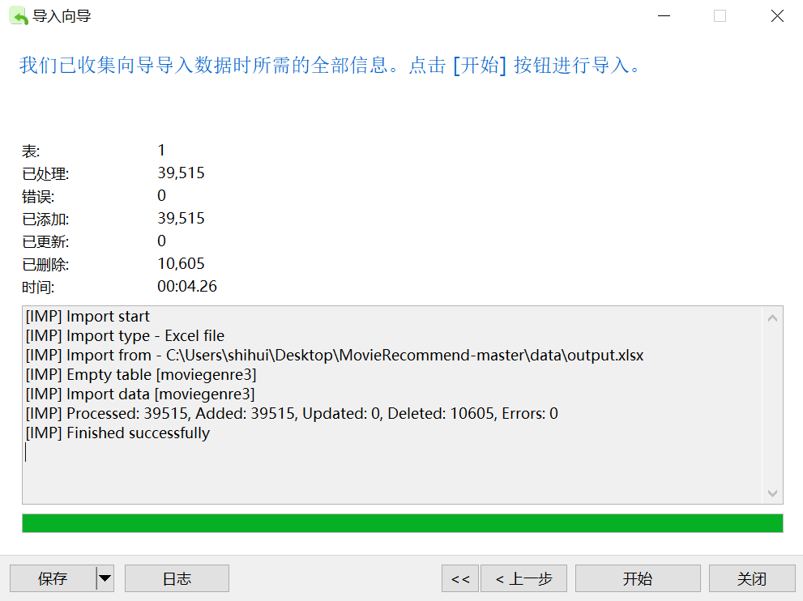

# 基于协同过滤的电影推荐系统 —— 调试中报错的解决方案


- 11.10 —— 11.11 

目标：解决“如何使用”的问题（复现）

## 一、配置运行环境

### (1) python3.6 虚拟环境配置

`conda create -n py36 python=3.6`


### （2）settings文件修改


## 二、数据库构建

参考资料：

- navicat安装教程：https://blog.csdn.net/qq_42055933/article/details/131310966

- navicat导入csv文件：https://blog.csdn.net/qfzhaohan/article/details/121358355

### （1）将csv文件导入mysql数据库表

navicat导入csv文件时，因为csv文件中没有列名，所以无法自动匹配

在excel中添加列名后，重新导入，这次可以自动匹配了，但是csv文件每行以`\r\n`结尾，而我们没有在自动导入中设置这个规则。错误位置如图所示：


于是想着把csv文件转换成excel后再进行导入。成功导入了一部分，但是出现新报错，先来看第一个报错：


报错：重复的id

回到excel中查找`11358`这个id，发现果然id重复了，且两条数据是完全一样的，删掉一条即可。


再导入，居然还有重复id，所以回到excel中看了看重复的id，发现还有挺多重复id的，写个python程序删除吧。去重python代码如下：

```
import pandas as pd

# 读取Excel文件
file_path = 'MovieGenre3.xlsx'  # 将 'your_excel_file.xlsx' 替换为你的Excel文件路径
df = pd.read_excel(file_path)

# 去除重复行，根据'imbid'列判断是否重复
df.drop_duplicates(subset='imdbId', keep='first', inplace=True)

# 保存去除重复数据后的文件
output_file_path = 'output.xlsx'  # 输出文件的路径和名称
df.to_excel(output_file_path, index=False)

print(f"去除重复数据后的文件已保存至 {output_file_path}")

```
用python处理后，神奇的事发生了，navicat导入时，除了重复id的报错，最重要的报错也消失了，我猜是由于python将数据重新进行了格式化。导入成功！



由于`users_resulttable.csv`中的数据类型较为单一，所以可以选择命令行导入的方式
（尝试了一下发现命令行导入对我来说更难，，，，所以还是选择图形化界面导入了，不要忘了照原文设置加主键哦）

## 三、运行项目

### （1）测试注册登录

1. 运行`python manage.py makemigrations`，报错有些库没装，装上就行，分别是（安装能兼容python3.6的版本）：

- pymysql==0.9.3

**注：再次执行makemigrations前在migrations目录下删除形如`0001_initial.py`的迁移文件**

2. 运行`python manage.py migrate`, 报错`django.db.utils.InternalError: (1050, "Table 'users_user' already exists")`
找了一圈都是说表已经存在，但我在mysql中用了`show tables`命令，也没有找到这个表，所以先跳过这一步，看直接在浏览器中打开页面有没有问题。

3. 运行`python manage.py runserver`，可以看到页面是正常显示的


注册也没有问题，但登录时，输入用户名和密码后就报错：`(1146, "Table 'moviedata.django_session' doesn't exist")`，同时页面显示如下：


在作者仓库的issues里面找了找，参考这位兄弟的做法尝试了一下


migrate操作后不报错了！显示如下：


最后问题成功解决（感谢这位兄弟），登陆成功！


### （2） 测试推荐

#### 1.报错`pymysql.err.OperationalError: (2003, "Can't connect to MySQL server on '127.0.0.1' ([WinError 10061] 由于目标计算机积极拒绝，无法连接。)")`，页面显示如下：


参考：https://blog.csdn.net/dlwsd_/article/details/84934523

这个时候往前翻了一下报错输出，发现之前还有一个我没注意到的报错：`django.core.exceptions.ImproperlyConfigured: MySQLdb/mysqlclient 1.2.3 or newer is required; you have 0.9.3`，意思是pymysql版本太老了。

按照chatgpt的回答，使用`pip install --upgrade mysqlclient`更新驱动，但是在安装mysqlclient时一直出现`building wheels`的报错，之后尝试了离线安装的方法终于下载成功了。


但遗憾的是，connection error的报错仍然没有消失，于是开始对整个项目中的所有代码进行理解。终于！！！在`users`目录下的`views.py`文件中发现了猫腻


好家伙，原来是因为只改了settings.py中的数据库连接设置，没改细节处的设置。（尝试过在项目中全局查找关键词`conn`,但没找出来）

根据自己的数据库配置进行修改后，报错消失，但是又出现了新的报错

#### 2. 报错：`KeyError: '1001'`


意思是没有找到1001这个键对应的值

对于这个问题调试了很久，经过从头梳理view.py中的代码并且检查其中数据结构与数据库的对应关系，终于发现了问题所在。

作者在README中做了如下提醒，为`user_resulttable`加入id字段：


但是当加入id字段并将其设为主键后，在推荐函数的逻辑中`trainset`字典的键就变成了id, 并且随着用户提交新的评分记录，id会自增，起到的是标识记录的功能，而不是标识用户的功能，如下图所示：


所以当我们想通过`trainset['1001']`获取**userId**为1001评分过的电影时，实际是在获取**id**为'1001'的那条记录。但userId为1001的用户没有评论这么多条，所以表中自然没有id为1001的记录，就会出现keyError。

并且通过代码自动生成的`user_resulttable`表似乎只记录了当前用户进入到推荐系统后新提交的评分，这与代码中的数据结构和操作逻辑整个就是不符的！

所以，之前参考的那个兄弟提供的解决方案是只用重新导入`MovieGenere3.csv`，但是  `user_resulttable`表其实也需要重新导入，导入的就是`data`文件夹中的那个`user_resulttable.csv`。重新导入后的`user_resulttable`表如下所示：


#### 3. 修改调用推荐函数时传入的'userId'参数


可以看到，原代码将request请求get到的userId加了1000，又转换为字符串，也就是原本的userId是'1',现在变成了'1001'，然后用'1001'作为键到数据表中去查找记录。但是我们现在的数据表中userId变成了'1','2'...,所以对于get到的userId，不用对其额外加上1000。

#### 4. 报错：`user_sim_mat`未赋值

在views.py中，原代码将user_sim_mat定义为全局变量，并在`calc_user_sim`函数中将其拷贝给另一局部变量：`usersim_mat = user_sim_mat`，但是在计算完推荐结果后`user_sim_mat`并没有被重新赋值，导致在recommend函数中用到它时（也就是下图中标黄的地方），它的值仍未空。


所以在计算完推荐结果后，需要对它重新赋值，这里就不详细演示具体过程了。

#### 5. 修改前端

原始主页css样式比较简单，并且有一些电影的海报图链接失效，导致图片无法正常显示。所以在这一步，主要是添加了一些前端样式，并且对不能正常访问链接的图片，设置一个默认图片链接，最后效果如下所示：


- 11.12 创新


